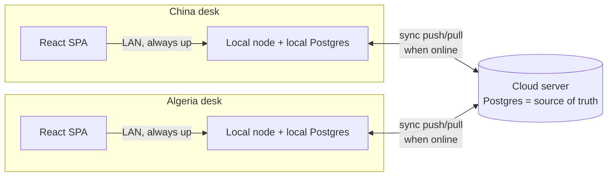

# Swift Cargo — Offline & Multi-Site Sync Architecture

**Status:** design (approved direction). Blocks the offline milestone; the schema
additions here should be baked into the orders/accounts build so tables are
sync-ready from day one.

## 1. Goals & constraints

- The net is **unstable**. Each desk must stay **100% usable offline** — create
  orders/bons, take cash, reconcile, settle — with no spinner and no data loss.
- **Three sides:** a **cloud server** (hub / source of truth) and two desks,
  **China** and **Algeria**, each in its own building on its own connection.
- Money must be **exactly coherent** across all three once synced.
- Low concurrency (~4 admins, ~2 per desk) and **transport takes days**, so the
  same record is essentially never edited by both sides at the same instant.

## 2. Topology — star (hub + two desk nodes)



- Each desk runs **its own copy of the app + its own local Postgres**. The
  `embedded-postgres` we already use gives every desk a real local DB with **zero
  internet** — this is the whole reason offline is cheap for us.
- The browser always talks to the **local** node → the UI is always instant and
  fully functional. "Offline" only pauses the background sync worker; the cashier
  never notices.
- Desks sync with the **cloud hub only** (star), never peer-to-peer. Simpler and
  sufficient.

## 3. Core model — append-only events + derived projections

The one idea everything rests on:

> **Every state change is an immutable event. Balances are never stored as
> independently-writable numbers — they are a deterministic function (a sum) of
> their event log. Merging two sites = replaying their events; re-summing yields
> the same balance regardless of order.**

We are already 80% there: `transactions`, `person_ledger`, `bon_status_history`,
`audit_log`, `conversions`, `stock_inventory` are append-only; `caisse_balances`,
`person_balances`, `stock_items.quantity` are projections. Sync makes the **sum
the authority** and treats projections as rebuildable caches.

## 4. Why coherence is achievable here (domain gifts)

1. **Single-writer money.** Per-office caisses mean the China caisse is only ever
   mutated at China, the Algeria caisse only at Algeria. **No caisse is ever
   written by two sites → money never conflicts.** (This is why the two-office
   caisse decision is also the offline decision.)
2. **Ownership by lifecycle stage.** China creates orders/bons + departs + China
   cash. Algeria does arrival/reconciliation/settlement + Algeria cash. Different
   rows, different days.
3. **Days of slack.** An order created in China is synced to Algeria long before
   the goods physically arrive. No real-time coordination needed.
4. **The only shared entity is a person account** (a fournisseur/passager both
   sides touch). Because it is append-only and its balance is a **sum**, both
   sides append independently and it still reconciles exactly.

## 5. Identity & ordering

- **`uuid UUID`** on every syncable row (default `gen_random_uuid()`, built into
  Postgres). This is the cross-site identity and the **idempotency key** — applying
  the same event twice is a no-op.
- **`origin_site TEXT`** ('china' | 'algeria' | 'cloud') — who created it.
- **Total order comes from the hub:** when the hub accepts an event it stamps a
  monotonic **`server_seq BIGSERIAL`**. Every node replays the hub feed in
  `server_seq` order → all nodes converge to the identical state.
- Human references get a **site prefix** so offline desks never collide:
  `OP-CHN-00001`, `SC-ALG-00042`. (Per-site sequence + prefix.)
- Wall clocks are **not** trusted for correctness (offline machines skew). `server_seq`
  is the order of record; `updated_at` is only a best-effort tiebreak for the rare
  mutable-entity conflict (§7).

## 6. The sync channel — one generic change feed (app-level CDC)

Because every mutation already runs through `withTx`, we capture changes in the
**same transaction** as the mutation — no DB triggers, no drift.

- **`sync_outbox`** (written by services, one row per change):
  `uuid, entity, entity_uuid, op ('insert'|'update'), snapshot JSONB, origin_site,
  server_seq BIGINT NULL, created_at`. `server_seq NULL` = not yet acknowledged by
  the hub → this doubles as the **outbox** (rows to push) *and* the applied-cursor.
- **`sync_cursor`**: the highest `server_seq` this node has pulled and applied.

Both append-only events and mutable-entity updates flow through this one channel:
inserts carry the full row snapshot; updates carry the new snapshot. Desks apply
by **upsert on `entity_uuid`, keeping the higher `server_seq`** → idempotent and
order-independent.

### Protocol

```
PUSH  (desk → hub):  POST /sync/push { events: [ {uuid, entity, entity_uuid, op, snapshot, origin_site}... ] }
      hub inserts each unseen uuid, stamps server_seq, returns { acked: {uuid: server_seq} }
      desk stamps those server_seq locally (clears outbox)

PULL  (desk → hub):  GET /sync/pull?since=<cursor>&excludeOrigin=<me>
      hub returns events with server_seq > cursor (ordered)
      desk applies each idempotently, recomputes affected projections,
      advances sync_cursor to the max server_seq applied
```

- **Idempotent, retry-safe:** any push/pull can be retried over flaky net; UUID
  dedup + `server_seq` upsert guarantee no double application.
- **Frequency:** poll every N seconds when online + immediately after a local
  write; exponential backoff when offline. Small payloads (low volume).

## 7. Conflict rules (small surface by design)

| Data | Sync semantics | Conflict handling |
|---|---|---|
| `transactions`, `conversions`, `person_ledger`, `bon_status_history`, `audit_log`, `stock_inventory` | append-only events | none — replay + re-sum projections |
| `caisses` money (per office) | single writer | impossible by construction |
| `person_balances`, `caisse_balances`, `stock_items.quantity` | **projections** | never synced; recomputed from events on apply |
| `orders.status`, `bons.status` | **derived** from `bon_status_history` | recompute on apply; no LWW needed |
| `fournisseurs`, `passagers`, `stock_items`, `stock_categories` (profile fields) | mutable entity | **last-writer-wins** by `server_seq` (hub order), `updated_at`+`origin_site` tiebreak. Low risk (edited at one desk). |
| `currencies`, `exchange_rates`, `admins` | cloud-authoritative reference | edits still allowed anywhere; sync as events/LWW. Rates: keep the append-only `exchange_rates` history — "current rate" is the latest by `server_seq`. |

### Cross-office cash transfer (China → Algeria)

Model as **two independent single-writer legs** sharing a `transfer_uuid`:

1. China desk records **leg OUT** (China caisse −X) as an event when cash leaves.
2. Algeria desk records **leg IN** (Algeria caisse +X) when the cash physically
   arrives (possibly days later, after sync).

Each leg is written by its owning site only → conflict-free, and "money in transit"
is naturally visible (an OUT with no matching IN yet). This replaces the current
instantaneous `transfer()` for the cross-office case.

## 8. Security between nodes

- Each desk holds a **node credential** (API key / mTLS) to authenticate to the
  hub — separate from user sessions. Every event still carries the acting
  `admin_id`.
- All sync over **TLS**. The hub validates that a desk only pushes events for its
  own `origin_site` (a China node cannot forge Algeria caisse movements).

## 9. Deployment

- **Cloud:** Node app + managed/VPS Postgres. Exposes the API + `/sync/*`.
- **Desk:** one machine per office runs the app + local Postgres as an
  auto-starting service; other office PCs open the browser to that LAN host.
- **Per-node config:** `SITE` (china|algeria|cloud), `CLOUD_URL`, `NODE_TOKEN`.
  A single codebase; behavior differs by `SITE`.

## 10. Bootstrap & recovery

- **New desk:** pull the full feed from `server_seq = 0` → rebuild local DB →
  switch to incremental. (Reuses the same `/sync/pull`.)
- **Desk DB loss:** re-bootstrap from the hub. Only *un-pushed* local events are at
  risk → mitigate by pushing eagerly when online + periodic local DB snapshot.
- **Hub loss:** restore from backup; desks re-push anything with `server_seq NULL`.
- **Projection drift (paranoia check):** a `recomputeAllProjections()` job re-derives
  every balance from its ledger; can run nightly to prove books tie out.

## 11. Schema changes (make current tables sync-ready)

Add to every **syncable** table (all except pure projections):

```sql
ALTER TABLE <t> ADD COLUMN uuid UUID NOT NULL DEFAULT gen_random_uuid();
CREATE UNIQUE INDEX <t>_uuid_uq ON <t>(uuid);
ALTER TABLE <t> ADD COLUMN origin_site TEXT NOT NULL DEFAULT current_setting('app.site', true);
```

Syncable: `admins, currencies, exchange_rates, caisses, transactions, conversions,
fournisseurs, passagers, stock_categories, stock_items, stock_inventory, bons,
bon_lines, bon_status_history, orders, person_ledger, audit_log`.
Projections (NOT synced, rebuilt locally): `caisse_balances, person_balances`.
New infra tables: `sync_outbox`, `sync_cursor`.
Reference sequences (`bon_ref_seq`, `order_ref_seq`) → per-site prefixed refs.

## 12. Phased implementation

1. **Sync-ready schema** — add `uuid`/`origin_site` to syncable tables, `sync_outbox`
   + `sync_cursor`, `SITE` config, site-prefixed references. **Do this together with
   the orders/accounts build** so nothing is retrofitted.
2. **Sync engine** — service-level outbox writes (inside existing `withTx`), the
   background worker, hub `/sync/push` + `/sync/pull`, idempotent apply + projection
   recompute. Sync-status chip in the UI.
3. **Cross-office transfer** as two legs; node auth; deployment scripts (auto-start
   service per desk; cloud host).
4. **Bootstrap/recovery** — full-feed bootstrap, nightly reconcile job, local
   snapshots.

## 13. What this means for the in-flight orders/accounts work

- Fold the §11 columns into migration `003` (and a `004_sync.sql` for `sync_outbox`/
  `sync_cursor`) so the new tables (`orders`, `person_ledger`) are born sync-ready.
- Keep every write inside `withTx` (already the rule) so the outbox insert is atomic
  with the change.
- Keep balances as projections (already the case) — never expose a "set balance"
  path; only "append event → recompute".
